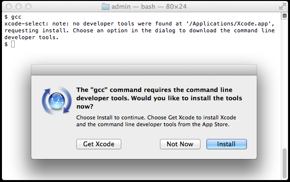
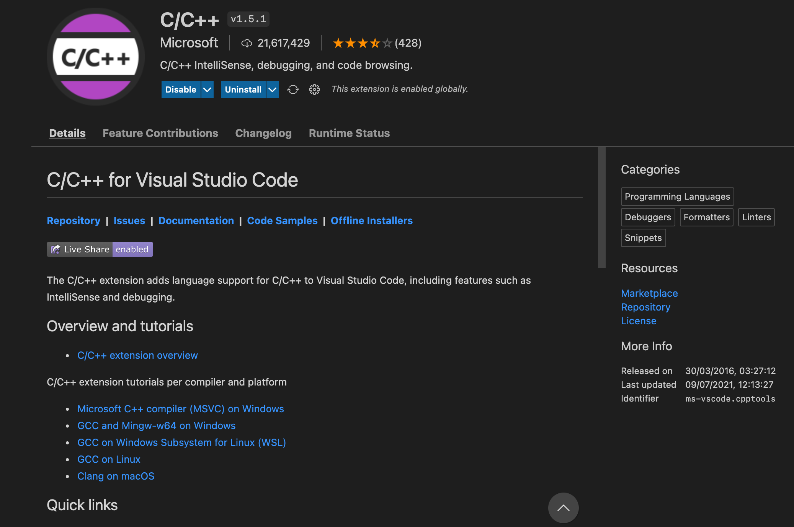
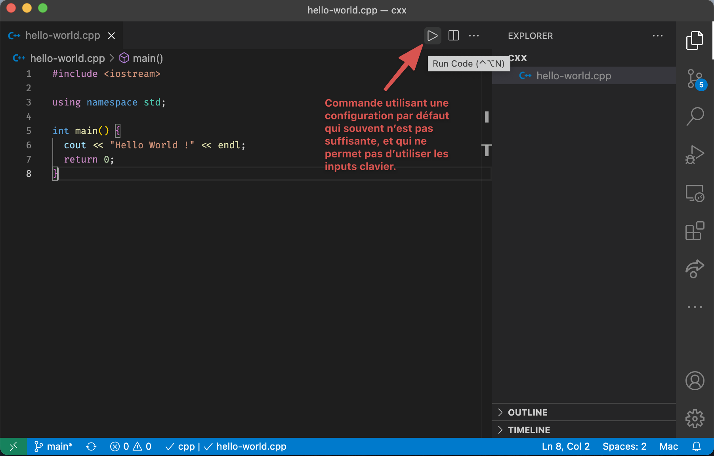
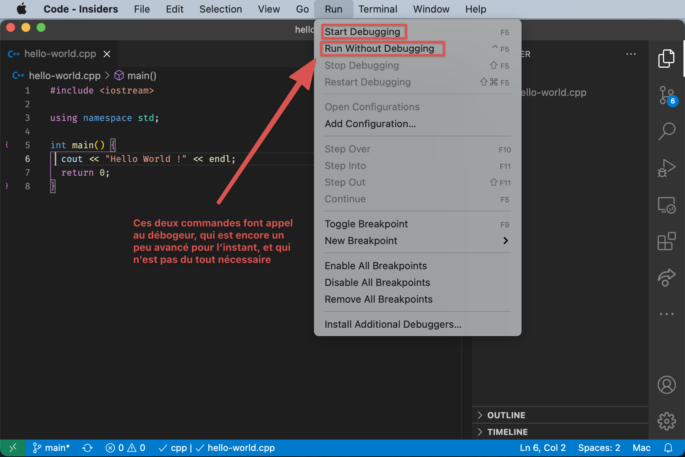
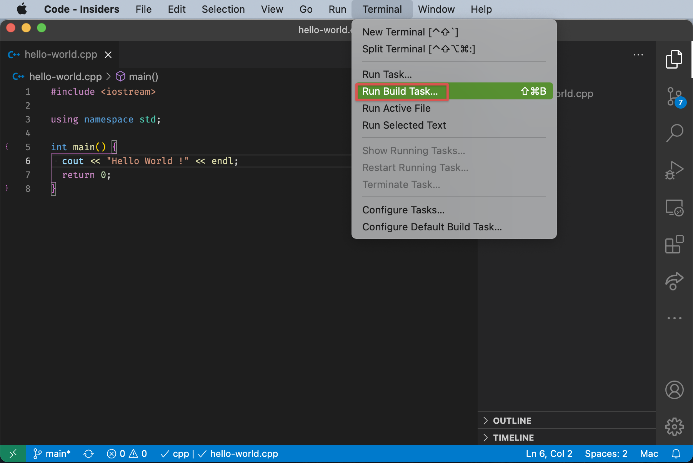
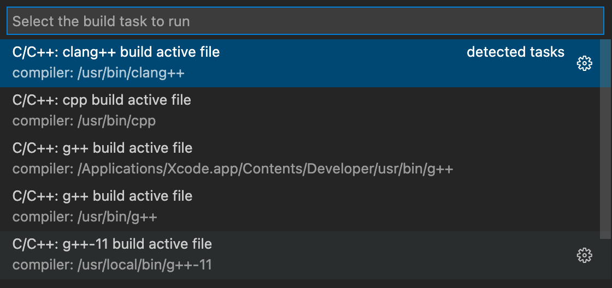

# Pour ceux qui veulent mieux que Geany

Bon matin jeune propédeuticien ! 👋 Si tu lis ces lignes c'est que tu commences un cours d'intro à la programmation C++ et si ton prof est notre bon vieux Chapps national, on t'a certainement recommandé d'utiliser l'éditeur de code [Geany](https://www.geany.org/). C'est un éditeur très simple à configurer et à utiliser, mais certains d'entre vous pourront trouver qu'il est un peu trop simpliste, pas assez customizable ou encore pas joli (l'esthétisme est très important pour les programmeurs). Je vous propose ici un autre éditeur et quelques autres outils pratiques pour la programmation sur macOS. 

## 1. Installer un compilateur et les outils nécessaires
Ceux d'entre vous qui ont déjà installé un compilateur C/C++ (`clang` ou `gcc` selon les préférences) peuvent passer cette étape.
Ceux qui ne sont pas sûrs peuvent le vérifier en ouvrant une fenêtre de terminal (via Spotlight ou en cherchant directement l’application Terminal dans le dossier Applications) et taper :

```bash
clang --version
# ou 
gcc --version
```

Si le compilateur est déjà installé, cela affichera son numéro de version, sinon une fenêtre de dialogue s'ouvrira pour vous demander d'installer les *'Command Line Tools'* (voir image en dessous), un ensemble de compilateurs et autres outils pour le développement sur macOS. 


Cliquez dessus pour les installer. Si cette denêtre n'apparaît pas, entrez 
```bash
xcode-select --install
```
dans le terminal.\
👍 Voilà ! Vous avez à présent installé tous les compilateurs et outils nécessaires pour écrire et compiler du code C++ sur macOS. Cependant, il est possible que dans le futur vous ayez besoin d'installer d'autres outils comme des bibliothèques, des débogueurs, etc. Pour ce faire, le plus simple est de passer par un gestionnaire de paquets :  je recommande [Homebrew](homebrew.md).

## 2. Installer l'éditeur de texte Visual Studio Code

### Un peu de terminologie
À mon sens, Visual Studio Code (ou VSCode) est un simple **éditeur de texte** (*text editor* en anglais), au même titre que Geany. Ce n'est pas un **environnement de développement** (*IDE* en anglais) à proprement parler car il ne comprend aucun compilateur ou outil nécessaire pour exécuter le code qu'on écrit, l'analyser et le débugger. VSCode ne permet (seul) que d'écrire des fichiers de code et d'éventuellement gérer ces fichiers (grâce à git ou un autre gestionnaire de version). C'est uniquement mon avis, et beaucoup d'autres appellent ça un IDE. Je serai ravis d'en discuter avec vous, via une Issue ou autre 😇.

### Installation
Si vous avez installé Homebrew vous pouvez tout simplement entrer
```
brew install --cask visual-studio-code
```
dans un terminal pour installer l'application. Sinon, vous pouvez la télécharger à partir du [site officiel de Microsoft](https://code.visualstudio.com/).

Pour l'ouvrir, utiliser Spotlight ou aller dans le dossier Applications.

## 3. Configuration
### Un mot sur le fonctionnement de VSCode
Lorsqu'on ouvre VSCode pour la première fois, aucun fichier ou dossier n'est ouvert. Grâce à `Cmd+O` ou en allant dans le menu Fichier/File, on peut ouvrir un fichier ou un dossier.  
Ouvrir un fichier l'ouvre tout simplement et l'affiche. Ouvrir un dossier permet d'afficher à gauche dans le menu explorer le contenu du dossier et facilement créer des nouveaux fichiers ou sous-dossiers. Cela permet également de plus facilement ouvrir un dossier contenant un projet en particulier, et également d'ajouter des réglages propres à un certain dossier, qui vont être partagés par tous les fichiers contenus à l'intérieur.  
Ces réglages locaux sont contenus dans des fichiers au format JSON (extension `.json`), eux-mêmes contenus dans un dossier `.vscode` à la racine du fichier.  
Ces réglages vont écraser les réglages globaux définis pour toute l'application (contenus dans un fichier `settings.json` placé dans les dossiers internes de VSCode).

Je recommande grandement de créer un dossier spécifique pour les programmes C++ (nommé par exemple `cxx`) que vous ouvrirez à chaque fois que vous aurez besoin d'écrire un programme. Pour le créer dans le dossier home de votre utilisateur  puis l'ouvrir, ouvrez un terminal et entrez:
```bash
cd ~
mkdir cxx
cd cxx
```
> ⚠️ Attention ⚠️ Ne mettez jamais d'espaces dans vos noms de fichiers et de dossiers !! C'est la règle numéro 1 ! Cela complique tout et vous oblige d'*escpae* ces espaces dans la plupart des cas. Préférez remplacer les espaces par des tirets '-' ou des tirets bas '_'.

> 🤫 **Astuce** : pour ouvrir facilement un dossier ou un fichier dans VSCode depuis le terminal, vous pouvez ouvrir la Command Palette dans VSCode et chercher `Shell Command : Install 'code' command in PATH`. À présent vous pouvez ouvrir un dossier avec `code <nom>`. Exemple:
> ```bash
> cd ~/cxx
> code .
> ```

### Maintenant on attaque le C++ !
- Aller dans l'onglet Extensions (Cmd+X) et télécharger l'extension C/C++ de Microsoft

Cette extension contient la colorisation syntaxique pour les langages C et C++ ainsi que le nécessaire pour utiliser Intellisense, le programme d'auto-complétion de VSCode.

- Ouvrir la Command Palette (Cmd+P) et chercher `Preferences: Open Settings (JSON)`. Rajouter les lignes suivantes à l'intérieur des accolades:
```json
// Compilateur et standard C/C++
"C_Cpp.default.compilerPath": "/usr/bin/clang++",
"C_Cpp.default.cStandard": "c17",
"C_Cpp.default.cppStandard": "c++17",
// Configuration d'Intellisense, le programme d'auto-complétion de VSCode
"C_Cpp.updateChannel": "Default",
"C_Cpp.errorSquiggles": "Enabled",
"C_Cpp.intelliSenseEngineFallback": "Enabled",
"C_Cpp.intelliSenseEngine": "Default",
"C_Cpp.default.intelliSenseMode": "clang-x64",
// recherche des headers et bibliothèques
"C_Cpp.default.includePath": [
    "${workspaceFolder}/**",
    "/usr/local/include/**"
],
"C_Cpp.default.browse.path": [
    "/usr/local/lib",
    "/usr/local/include",
]
```
Votre fichier `settings.json` devrait ressembler à [celui-ci](files/demo-settings.jsonc). Si certaines des préférences ajoutées existaient déjà, supprimez les anciennes versions.

## 4. Écrire un premier programme
Une fois le dossier `cxx` ouvert dans VSCode, créer un nouveau fichier [`hello-world.cpp`](files/demo-hello-world.cpp) et écrivez :
```cpp
#include <iostream>

using namespace std;

int main() {
  cout << "Hello World !" << endl;
  return 0;
}
```
Pour exécuter le fichier, il y a beaucoup de commandes qui se ressemblent et qui ne font pas la même chose. Celle qu'il ne faut pas utiliser sont :

et


Nous allons utiliser les *tasks* pour compiler (*build*) notre code et l'exécuter.  Vous trouvez ces tasks dans le menu Terminal :

Quand vous cliquez sur `Run Build Task …` (en éditant le fichier `hello-world.cpp`), une liste de tasks par défaut s'ouvre. Elle ressemble à ça :

Elle est générée à partir des compilateurs détectés par VSCode, donc elle peut être différente de la mienne. Ces tasks vont tout simplement compiler notre fichier avec une syntaxe du style 
```bash
clang++ -g hello-world.cpp -o hello-world
```
Cette syntaxe basique suffit pour notre programme Hello World mais vous devrez la customiser dans le futur pour inclure des options de compilateur comme le standard C++ (11 minimum, mais moi j'utilise souvent 17). Pour cela nous allons créer notre propre task en allant dans le même menu Terminal puis en choisissant `Configure Tasks…` :

Un fichier `tasks.json` a été créé et nous pouvons y coller le contenu de [ce fichier](files/tasks.json). Cela définira deux tasks qu'on peut utiliser comme suit:
[build run task](images/build-run-task.gif)

Et voilà, vous pouvez maintenant écrire et exécuter du code C++ 😊 

## 5. Aller plus loin
Vous pouvez modifier les tasks précédentes selon vos préférences, ou en créer de nouvelles en vous aidant de la [documentation officielle](https://code.visualstudio.com/docs/editor/tasks#vscode).

Vous pouvez customiser l'apparence de VSCode avec des thèmes. Pour cela allez dans l'onglet Extensions (Cmd+X) et chercher des thèmes. Mes préférés sont [Monokai Pro](https://marketplace.visualstudio.com/items?itemName=monokai.theme-monokai-pro-vscode) et [Material Theme](https://marketplace.visualstudio.com/items?itemName=Equinusocio.vsc-material-theme).

Voici également d'autres extensions utiles (même si non indispensables) :
- [Better C++ Syntax](https://marketplace.visualstudio.com/items?itemName=jeff-hykin.better-cpp-syntaxhttps://marketplace.visualstudio.com/items?itemName=jeff-hykin.better-cpp-syntax)
- [Bracket Pair Colorizer 2](https://marketplace.visualstudio.com/items?itemName=CoenraadS.bracket-pair-colorizer-2)
- [Tabnine AI Code Completion](https://marketplace.visualstudio.com/items?itemName=TabNine.tabnine-vscode)